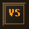
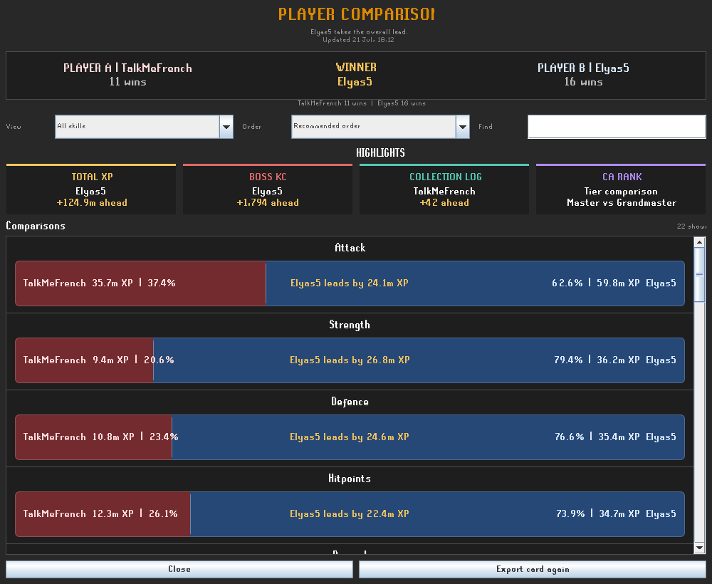
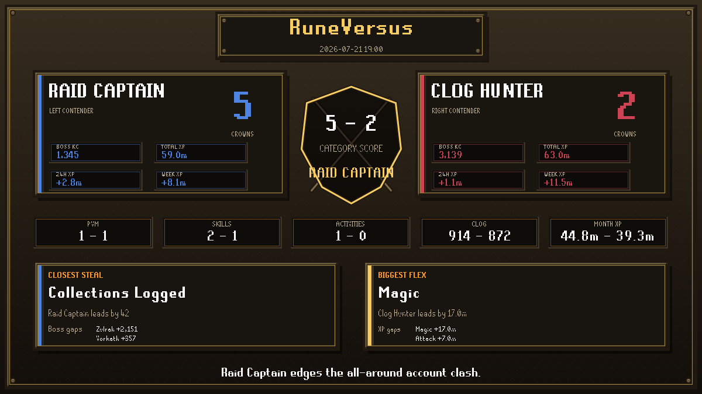
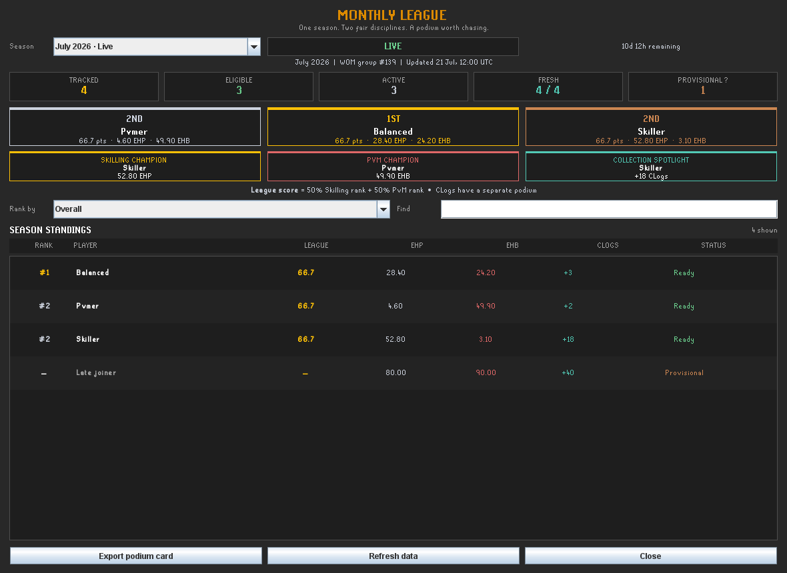

<p align="center">
  
</p>

<h1 align="center">RuneVersus</h1>

<p align="center">
  <strong>Compare accounts. Crown clan leaders. Turn progress into competition.</strong>
</p>

<p align="center">
  <a href="https://github.com/hakimbalestrieri/RuneVersus/actions/workflows/build.yml"></a>
  
  
  <a href="LICENSE"></a>
</p>

RuneVersus is a RuneLite plugin for fast, visual Old School RuneScape comparisons.
It turns public account data into readable player matchups, complete clan rankings,
fair calendar-month leagues, and OSRS-style cards ready to share.



## One plugin, three competitive views

| Player comparison | Clan performance | Monthly league |
| --- | --- | --- |
| Put two RSNs head to head across XP, individual skills, boss KC, activities, CLogs, and recent form. | Rank every member over **24h, week, month, year, or all-time**, including every supported boss. | Run a live calendar-month competition with EHP/EHB scoring, eligibility safeguards, podiums, and archived results. |
| Proportional red/blue bars make every lead immediately visible. | Search, sort, filter by boss, refresh the data, or export the leaders. | Browse the current season and the previous eleven months from one polished window. |

## Player comparison

- Compare two typed names or load players directly from the in-game clan roster.
- Compare total XP, every skill, every boss KC, public CLog count, clues, and activities.
- Optionally add **24h**, **week**, and **month** XP through Wise Old Man.
- See the winner, closest steal, biggest flex, category score, exact gap, and proportional share.
- Right-click a visible player or clan member to start a comparison.
- Keep the detailed comparison in the side panel or open it in a large standalone window.
- Export a 16:9 PNG with Auto, PvM, Skilling, Ironman, Clan War, or Underdog styling.



### Compact `!vs` results

RuneVersus can render a comparison in one short chat line:

```text
[VS] Alice 2-0 Bob | XP: +24.1M | CLog: 934 vs 901
```

```text
!vs Bob
!vs Alice, Bob
!vs "Lynx Titan" "Zezima"
```

`!vs <player>` compares the sender with that player. Use a comma or quotes when
names contain spaces. Incoming commands are rate-limited and their result is
rendered **locally** in your client; RuneVersus never sends a chat reply for you.

## Clan performance

Set a Wise Old Man group ID once, then open **Clan member comparison** to inspect
the whole group in a dedicated wide window.

- Switch between 24h, week, month, year, and all-time data.
- Rank by XP, collection-log unlocks, total boss KC, or one selected boss.
- When a boss is selected, the table focuses on exactly what matters: rank,
  player, and KC.
- Review clan totals, active members, average active XP, leaders, tracked state,
  and last-update time.
- Search members instantly and refresh WOM data on demand.
- Export a progress card containing the 15 period/category leaders.

## Monthly league

The Monthly League gives a clan a competition that resets naturally at
**00:00 UTC on the first day of every month**.



### Scoring that respects account progression

Raw XP and raw KC heavily favor particular account stages and activities.
RuneVersus therefore uses Wise Old Man efficiency metrics:

```text
Overall score = 50% clan-relative EHP rank + 50% clan-relative EHB rank
```

- **EHP** normalizes skilling progress against efficient hours played.
- **EHB** normalizes bossing progress against efficient hours bossed.
- Each category awards a 0–100 clan-relative score; ties share a rank.
- If no eligible member records activity in one category, that category is
  omitted instead of diluting every score.
- **Collection Log gains have a separate podium.** They never affect Overall,
  because early-account slots are fundamentally easier to obtain than late-game slots.

### Competitive safeguards

- The entry window remains open for the first **72 hours** of the month.
- A member needs both a verified clan join date and a usable WOM snapshot within
  that window to enter the competitive ranks.
- The roster freezes on the first successful refresh after the 72-hour deadline.
- Late or unverifiable members stay visible as **Provisional**, but cannot enter a podium.
- At month end, eligible players need a snapshot from the final **48 hours**.
- The first successful post-season refresh seals the result locally; later
  refreshes cannot rewrite that final podium through the plugin.

For a single authoritative clan result, nominate one organizer to refresh after
the entry window and again after month end. Archives are local integrity records,
not cryptographically tamper-proof files.

## Quick start

1. Install **RuneVersus** from the RuneLite Plugin Hub and enable it.
2. Open the RuneVersus side panel and enter two RSNs.
3. Press **Compare players**.
4. For clan tools, copy the numeric group ID from your Wise Old Man group page
   into `RuneVersus settings → Clan → WOM group ID`.
5. Enable **Recent XP details** only if you want 24h/week/month player form.

During development or before the Plugin Hub listing is live, build and run the
plugin locally using the commands in [Development](#development).

## Settings

| Section | Setting | Default | What it changes |
| --- | --- | :---: | --- |
| Player data | Account type | Normal | Chooses the official hiscore endpoint for both players. |
| Player data | Recent XP details | Off | Sends compared RSNs to WOM for 24h/week/month XP. |
| Player data | Private comparison data | Off | Reads optional local PB, detailed CLog, and CA-tier properties. |
| Player data | Open comparison window | On | Opens the full player matchup in a separate wide window. |
| Card export | Auto-save PNG | On | Saves a duel card after each successful comparison. |
| Card export | Copy PNG path | On | Copies the saved file path when the clipboard is available. |
| Card export | Card style / verdict tone | Auto / Fun | Controls the exported card presentation. |
| Clan | Right-click players | On | Adds `VS Compare` to visible players and clan members. |
| Clan | Clan VS Set options | On | Adds optional `VS Set A` and `VS Set B` clan-list shortcuts. |
| Clan | WOM group ID | Empty | Enables clan rankings and monthly leagues for that group. |

## Data, privacy, and local files

RuneVersus deliberately keeps its data model small and transparent.

| Source | Used for | Behaviour |
| --- | --- | --- |
| Official OSRS hiscores | Skills, boss KC, activities, public CLog count | Read-only lookups for the two compared RSNs. |
| Wise Old Man | Recent XP, clan gains, EHP/EHB, membership dates | Optional for player form; required for clan tools. Responses are cached, paced, size-limited, and respect `Retry-After`. |
| Local opt-in properties | PB times, detailed CLog count, CA tier | Disabled by default, read from your machine only, and never uploaded by RuneVersus. |
| Local PNG/archive files | Shareable cards and sealed monthly results | Stored inside the RuneLite directory; nothing is cloud-synced by this plugin. |

RuneVersus does not request, read, or store your Jagex Account credentials.

### Storage locations

```text
~/.runelite/rune-versus/cards
~/.runelite/rune-versus/leagues
~/.runelite/rune-versus/sync
```

Example optional sync file:

```properties
# ~/.runelite/rune-versus/sync/My_RSN.properties
collection.items=1242
combatAchievements.tier=Master
pb.Vorkath=73
pb.Tombs_of_Amascut=1218
personalBest.Zulrah=48
```

Private metrics appear only when both players provide the corresponding local
data. These files are user-supplied and intentionally treated as unverified;
they do not affect `!vs` or Monthly League scoring.

## Known limitations

- WOM rankings reflect available snapshots, not a live game telemetry feed.
- Monthly archives are per machine. Use one organizer if your clan wants one
  canonical final podium.
- Final local archives protect against accidental recalculation inside the
  plugin, but a user with filesystem access can edit or delete them.
- Full Collection Log contents and boss personal-best times are not publicly
  available for arbitrary accounts, so detailed versions remain local opt-in data.

## Development

RuneVersus uses the standard RuneLite external-plugin layout, Java 11, and no
non-RuneLite third-party runtime dependency.

```bash
./gradlew build
./gradlew run
```

Jagex Account users should follow RuneLite's
[development login guide](https://github.com/runelite/wiki/blob/master/Using-Jagex-Accounts.md)
and never share `.runelite/credentials.properties`.

Generate the checked-in Plugin Hub icon and presentation screenshots with:

```bash
./gradlew releaseAssets
```

The CI workflow builds and tests every pushed branch and pull request on Java 11.
For the release checklist and manifest format, see
[PLUGIN_HUB_SUBMISSION.md](PLUGIN_HUB_SUBMISSION.md).

## Feedback and contributing

Bug reports, balancing feedback, and focused pull requests are welcome through
the [RuneVersus issue tracker](https://github.com/hakimbalestrieri/RuneVersus/issues).
When reporting a data issue, include the selected period, account type, and
whether WOM data was enabled—never include RuneLite credentials.

## License

RuneVersus is available under the [BSD 2-Clause License](LICENSE).
